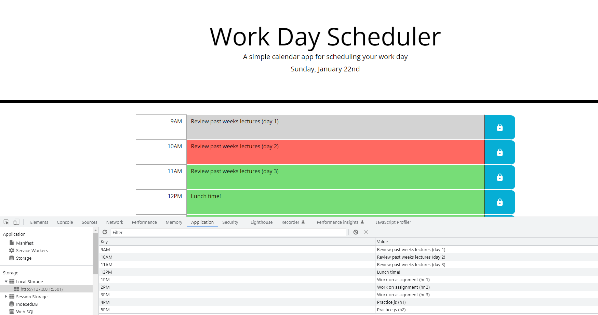

# Work Day Scheduler
*"A simple calendar app for scheduling your work day"*

## Description
The Work Day Scheduler provides an efficient way to plan & keep track of your daily working schedule for the current day in hand. 

A browser-based app that enables the user to plan their working day effectively through assigning work activities to hourly time blocks, thereby creating a full day schedule of planned work activities.

Work Day Scheduler utilises local storage in the browser so that user activities 'persist' and are not lost when the page is refreshed/reloaded.

*The screenshot below depicts a typical working day for a web development student using the Work Day Scheduler to plan for their studies. The developer console is visible at the lower section of the screenshot, demonstrating the key:value pairs for each time block as set once each 'save button' has been pressed to commit the respective activities to the schedule*

## Usage
Time blocks represent typical working hours and are colour coded depending on what time it is, time blocks for past hours in the day appear grey & time blocks ahead of the current time appear green, the time block representing the current time will appear red.

* Simply 'click' the cursor over a time block and type in the activity you wish to add for that time block.
* Then 'click' the save button to commit the activity to the scheduler for the specific time block that you've typed the activity in.
* Repeat the process for each time block with whichever activities that you are planning for the day.
* You can overwrite planned activities by amending &/or replacing the existing text and 'clicking' the save button once again (*you can repeat this process as many times you wish, making it ideal where plans may changes quickly within your working day*).

## Installation
Work Day Scheduler is a browser based app, just ensure that you have a working internet connection & then follow the link in the [deployed site section](#link-to-deployed-application) of this readme to launch the app.

## Link to Deployed Application
Here's a link to the deployed app;

* https://sam010000101.github.io/work-day-scheduler/

## Link to Github Repository
Here's a link to my github repo;
* https://github.com/Sam010000101/

## Badges

 &nbsp;  &nbsp;  &nbsp;  &nbsp;  &nbsp; 

## License

MIT License

Copyright (c) 2023 - Sam Brooke

Permission is hereby granted, free of charge, to any person obtaining a copy
of this software and associated documentation files (the "Software"), to deal
in the Software without restriction, including without limitation the rights
to use, copy, modify, merge, publish, distribute, sublicense, and/or sell
copies of the Software, and to permit persons to whom the Software is
furnished to do so, subject to the following conditions:

The above copyright notice and this permission notice shall be included in all
copies or substantial portions of the Software.

THE SOFTWARE IS PROVIDED "AS IS", WITHOUT WARRANTY OF ANY KIND, EXPRESS OR
IMPLIED, INCLUDING BUT NOT LIMITED TO THE WARRANTIES OF MERCHANTABILITY,
FITNESS FOR A PARTICULAR PURPOSE AND NONINFRINGEMENT. IN NO EVENT SHALL THE
AUTHORS OR COPYRIGHT HOLDERS BE LIABLE FOR ANY CLAIM, DAMAGES OR OTHER
LIABILITY, WHETHER IN AN ACTION OF CONTRACT, TORT OR OTHERWISE, ARISING FROM,
OUT OF OR IN CONNECTION WITH THE SOFTWARE OR THE USE OR OTHER DEALINGS IN THE
SOFTWARE.